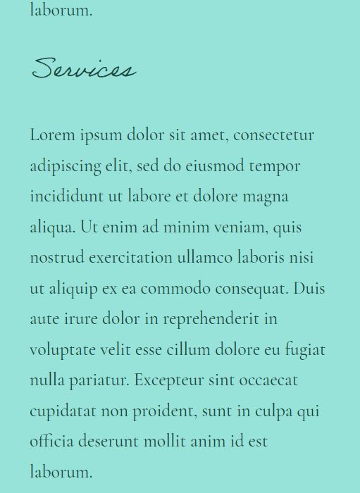

# :sauna_man: Agrippa 

## :paintbrush: Roman Baths Booking Website 

| WordPress version | Web Server version | PHP version | Database version |
| ---               | ---                | ---         | ---              |
| 6.4.2             | Apache 2.4.43      | 8.1.23      | MySQL 8.0.16     |

The ***"Agrippa"*** project uses a ***Block Theme*** for WordPress

## :toolbox: Tools I used to build ***"Agrippa"***: 

- [LocalWP](https://localwp.com/)
- WordPress
- PHP
- Adobe Express
- Adobe Fonts
- JSON
- JavaScript
- HTML
- CSS

## ⚡ Inspiration
I was inspired to title this project of mine after ***"Marcus Vipsanius Agrippa"*** , an important historical figure of Ancient Rome

## Mockups on Desktop (1920 x 917 px) 💻

## Mockups on Mobile (412 x 915 px) 📱

&nbsp;

##### 📚 Documentation [^1] [^2] [^3] [^4] [^5] [^6] [^7]
[^1]: https://developer.wordpress.org/themes/core-concepts/theme-structure/
[^2]: https://i0.wp.com/developer.wordpress.org/files/2023/10/template-hierarchy-scaled.jpeg?ssl=1
[^3]: https://developer.wordpress.org/block-editor/reference-guides/theme-json-reference/theme-json-living/
[^4]: https://developer.wordpress.org/themes/global-settings-and-styles/settings/
[^5]: https://developer.wordpress.org/advanced-administration/upgrade/migrating/
[^6]: https://developer.wordpress.org/themes/templates/introduction-to-templates/
[^7]: https://wordpress.org/plugins/insert-headers-and-footers/

